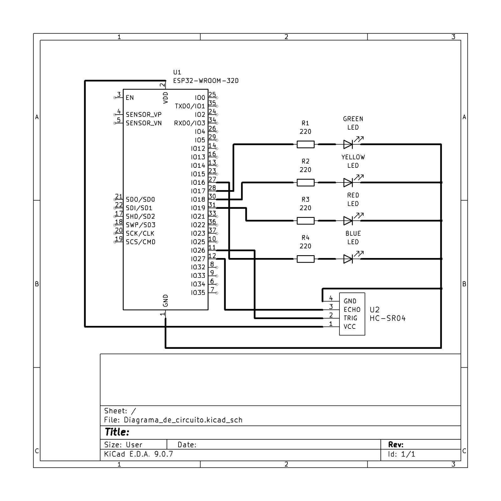
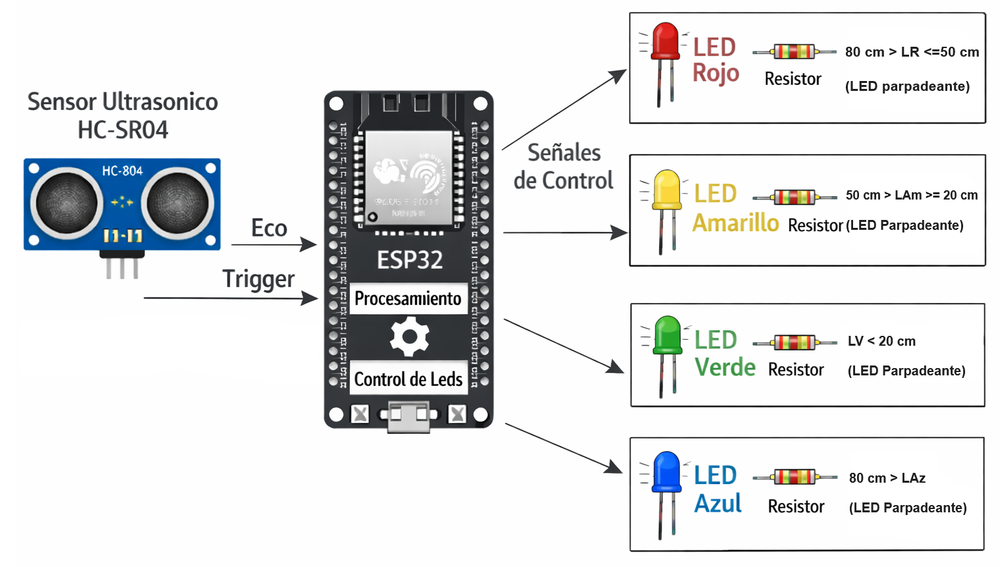
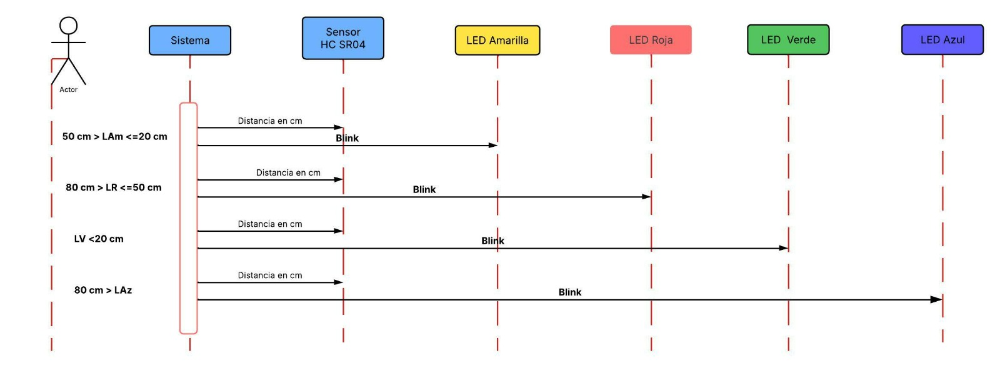
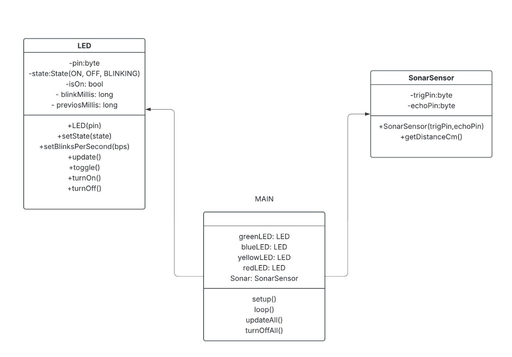

# Universidad Católica Boliviana Cochabamba
## Departamento de Ingeniería y Ciencias Exactas
## [SIS-234] Internet De Las Cosas
### Carrera de Ingeniería de Sistemas

---

# Informe sobre:
## Integración de sensores y actuadores en un objeto inteligente

### Evaluación de la Materia Internet de las Cosas

**Autores:**

- Vargas Prado Ariana Nicole  
- Zubieta Sempertegui Andres Ignacio  

---

Cochabamba - Bolivia  
Marzo 2026 

# 1. Requerimientos Funcionales y No Funcionales
## Requerimientos Funcionales

- El microcontrolador debe procesar la señal enviada por el sensor ultrasónico y convertirla en una medición de distancia expresada en centímetros.

- El sistema debe realizar mediciones de distancia de forma continua mientras el dispositivo esté encendido.

- El sistema debe clasificar la distancia detectada en diferentes rangos definidos por el sistema.

  Ejemplo de rangos:
  - Distancia menor a 40 cm  
  - Distancia entre 40 cm y 80 cm  
  - Distancia mayor o igual a 80 cm

- El sistema debe activar un LED rojo en modo parpadeo cuando la distancia detectada sea menor a 40 cm.

- El sistema debe activar un LED amarillo o naranja en modo parpadeo lento cuando la distancia detectada esté entre 40 cm y 80 cm.

- El sistema debe encender un LED verde de forma constante cuando la distancia detectada sea mayor o igual a 80 cm. 

## Requerimientos No Funcionales

- El sistema debe reaccionar a cambios en la distancia en un tiempo menor a 1 segundo.

- El sistema debe medir la distancia con un margen de error respecto a la distancia real.

- El código debe estar dividido en funciones o módulos que permitan modificar o ampliar el sistema fácilmente.

- El sistema debe permitir modificaciones futuras como agregar nuevos actuadores o sensores.

# 2. Diseño del Sistema

## 2.1 Diagrama de circuito

## 2.2 Diagrama de arquitectura del sistema

## 2.3 Diagramas estructurales y de comportamiento
### 2.3.1 Diagrama de secuencia

### 2.3.1 Diagramas de uml

# 3. Implementación

## 3.1 Código fuente documentado

# 4. Pruebas y Validaciones

# 5. Resultados

# 6. Conclusiones

# 7. Recomendaciones

# 8. Anexos